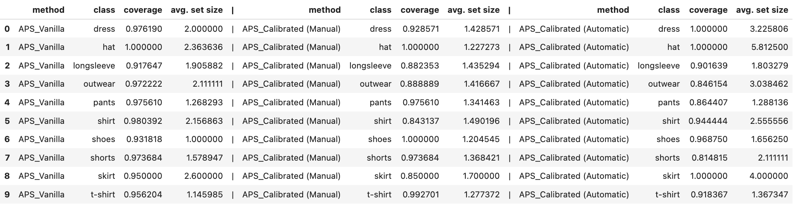

# aps-va-calibration

### Introduction

This project became merely an "extension" on top of "Week 8" of [ML Zoomcamp](https://github.com/DataTalksClub/machine-learning-zoomcamp) course. Since I'm following it in a self-pace mode I strive after each "week" to give it a bit of personal sprinkle, expanding on the introduced concepts to reinforce my understanding and acquire new knowledge in the process. This "week", I've strayed a bit, eager to learn the foundamentals of Conformal Prediction. 

### Feature extraction (`VGG19`, `InceptionV3` and `Xception`) + Gradient Boosted Trees (`catboost`)

While the idea of using pre-trained models to attach any architecture after convolution part is already implemented in various (and more sophisticated) ways in Kaggle competitions I wanted to try idea of attaching Gradient Boosting Trees instead of Dense Layers. I know that Neural Networks are a "way to go" when Computer Vision problems are at hand in terms of scores, but why not just experiment with it? I've chosen [`catboost`](https://catboost.a) library knowing that it works well "out of the box", it is blazingly fast and that behind it stands a lot of knowledge and tricks from people who were very successful on Kaggle ([and I'm not even scratching the surface of what it is capable of!](https://youtu.be/usdEWSDisS0)). Apart from other stuff I knew that success in your projects depend on quality of the data so I've decided to do feature extraction from three, randomly choosen [pre-trained models from Keras](https://keras.io/api/applications/). It seemed intuitive to me that if those models are already sucessful and have *different* architectures then if we join the features column-wise they should offer more "expressivenes" (different filters in convolution part) given the same dataset. Well, in math, "intuitive ideas" should be proven, and I guess in ML world the proving parts is more "relaxed" and the ideas should be at least tested. Short story: With a bit of hyperparameter tuning using `hyperopt` the `CatBoostClassifier` on "merged features" gave better accuracy score than using each one separately! Is it enough evidence for an intuitive idea \*cough\* H0 to be called "statistically significant"? I don't know. 

For extracting features I've included `inception-v3-extraction-train.ipynb` only, but trust me that they are pretty similar for every other notebooks just that they are "optimized in a moment" given time constraints of inference from the models and knowing that Free Tier from [Saturn Cloud](https://saturncloud.io/) (which is very generous!) shutdowns Jupyter Notebooks after an hour of "idle" time (waiting for loop to finish should be < 1h, or try spawning random cells during loop every `n` minutes with random nonsense e.g. `a=2`). That is why you might not find the code meaningful as I did, but do keep in mind that if you want to extract `file_id`'s (on which the features should be later joined) you have to set `shuffle=False` for not having a mismatch between `file_id`s pre-ordered by the image generator and the order of inference (which could be random!). 
Also know that Keras (image) generator process is "rotational" (because of epochs!) and hence you will see that I've done *poor men "data leakage" testing*: doing inference on few extra points and testing if the extra ones are already contained in a DataFrame via `train_df.duplicated().sum()`. Overall, I'm not very proud of the code quality, but it got the job done well. I haven't tested whether setting `batch_size > 1` would work and speed up the process by exploiting GPU usage, so give it a try!

If you want to see the comparison between training models separately and training them on 'merged features,' refer to `testing-models.ipynb`.

### Attempt to increase conditional coverage on Adaptive Predictive Sets by calibrating pre-trained model using VennABERS predictors

I gave a little informal introduction to Conformal Prediction and APS method in `final-model-training-and-calibration.ipynb`, so I will skip it here. ;)

Knowing that APS method offers desired marginal coverage, but approximate conditional coverage (on one hand because of the poorly calibrated model) the idea of using independent VennABERS predictors came to my mind. If we could calibrate the model then intuitevely `calibrated pre-trained model using VennABERS + APS` should have better conditional coverage than `pre-trained model + APS`. Since the rule of thumb is to use at least `n=500` calibration points I thought of approaching the problem iteratevly:

0) Split the dataset into `calibration points for VA + calibration points for APS + test + train + validation`,
1) Train the model and "fit" the VennABERS predictors using `n=500` calibration points,
2) Given `pre-trained model + VennABERS calibrators` obtain the calibrated probabilities given `calibration points for APS` as an input,
3) "Fit" the `MAPIE`'s classifier (obtain distribution of APS non-conformity scores) using calibrated probabilities from step 2)
4) Calibrate the probabilities from `test` dataset using `pre-trained model + VennABERS calibrators` and test the marginal + conditional coverage

To be honest, I don't know if someone has already tried this approach or if there exists a paper on such a theme, and I didn't know that multi-class VennABERS is already implemented but my "practitioner's" implementation gave better average prediction sets (which makes sense when using VennABERS) and it was faster than what I've called "automatic" approach (refer to the `final-model-training-and-calibration.ipynb` to see both of them in action). Also, the conditional coverage was not as I had intuited it to be, and it was not even better than using APS on a pre-trained model without calibration. SO, either there is a flaw in my thinking, or the implementation (both "manual" and/or "automatic") is bad. Let these only guide you in your further experimentation. I will give the resulting comparison table, but as I've already stated it is by NO means (no pun intended!) a statistically sound result. Even though the dataset is not intended for these purposes, I have literally abused it.

  

### Conclusion

Failed or not, by doing this pet-project I've expanded my knowledge by many folds:

1) Realized that instead of loops one should **always** find a way to make `numpy` more useful, 

2) For the first time ever I've managed to reason how to tap into others people code such that I make my "workarounds" actually work (refer to creating a `FakeClassifier` class in `final-model-training-and-calibration.ipynb`),

3) Probabilistic modeling is fun but challenging,

4) Other stuff I'm not aware I've learned,

`alpha`.) Learned that you should not trust `predict_proba`.

I want to thank [Saturn Cloud](https://saturncloud.io/) for providing generous Free Tier for the students of [ML Zoomcamp](https://github.com/DataTalksClub/machine-learning-zoomcamp), the course makers themselves ([Alexey Gregoriev](https://alexeygrigorev.com/)) and without any doubts the "[Awesome Conformal Prediction](https://github.com/valeman/awesome-conformal-prediction)" for all the resources that helped me grasp the foundamentals of Conformal Prediction. 
